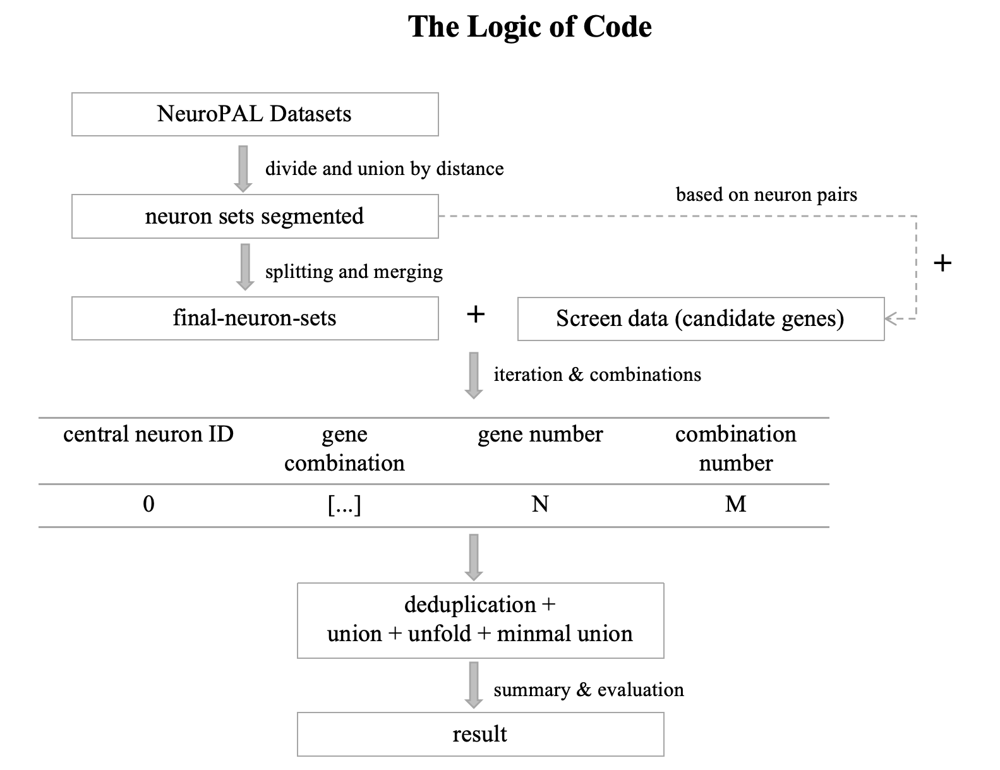
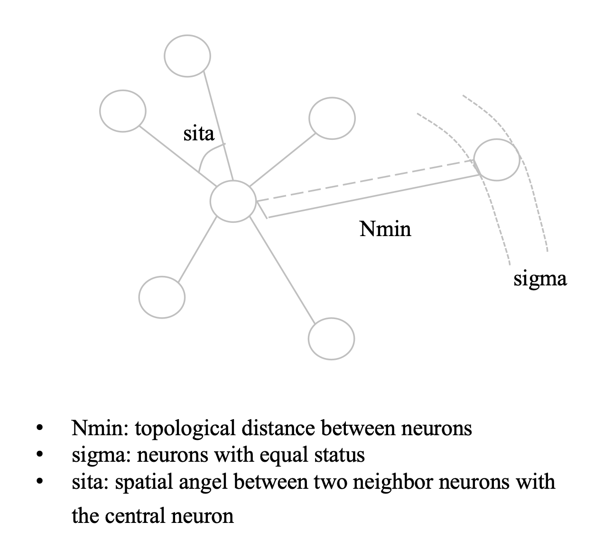

# **A Method of Screening Gene Combinations for Neuronal Identification in C. elegans**


## **System Requirements** 

The code were tested on Linux and Mac OS systems.

#### Create a python 3.8 virtual environment and activate it

```
# Installation guide
conda create --name env python=3.8
conda activate env

# Install Python dependencies
pip install -r requirements.txt
```

## **The Logic of Code**

***

<div align=center></div>


(1). To compute neuronal distances and get final neuron sets for iteration and gene combinations screening.  
(2). To select suitable candidate genes for screening.  
(3). To iterate and screen gene combinations.  
(4). To summary and evaluate.  

**To get final neuron pairs for iteration and screening gene combinations**

<div align=center></div>

Firstly, to divide the whole neurons into small sets by the topological boundary of each cell. Here, 
distance between neurons, proximity of boundary neurons and spatial angel between two neighbor neurons with the central neuron
are considered to determine the topological boundary range of each neuron. Through setting the angle smaller for example sita=1, the distance
parameter plays a major role in splitting neuron sets. After that, neurons in the small neuron sets segmented are paired in pairs and then
deduplicated to obtain the final neuron data used for iteration and screening gene combinations.

**The simple logic of iteration and screening gene combinations**

For each neuron pair, one deletes genes that express both or neither and then the left genes are able to identify the neuron 
pair. Through setting parameter [***at_least_gene_n***]() in the script generate_gene_combinations.py, one can adjust 
at least the number of genes identifying each neuron pair. Note that when number of the genes is less than at_least_gene_n, 
no gene combinations will be obtained for that neuron pair. Finally, gene combinations generated for each neuron pair are 
merged in order and minimal gene combinations are collected by minimal_union_logVersion.py.

***

## **Command Line Tool**

Follow the installation instructions.

***
### **To compute neuronal distances**

From a command line:
```
cd code/compute_neuronal_distances
```

e.g.

```
python main_divide_neuron_sets.py
```
**Description of part parameters:**  

**Nmin_list**: a list of maximum distances between neurons.  
**neuron_asymmetry**: optional ['Both', 'left', 'right'], for whether to distinguish L/R or D/V of neurons. Here, to select 'Both' for computing distances between neurons.  
**only_in_ganglia**: Bool type [True, False], for Whether to divide the neuron set according to ganglia. Here, to select False.  
**neurons_source**: optional ['union', 'position_7', 'position_11', ...], to select which NeuroPAL dataset to obtain final neuron data. 
Here. to select 'union' to merge all NeuroPAL datasets.  
**save_excel_dir**: to save neuron sets of each NeuroPALs under each Nmin.  
**save_final_dir_format**: to save the final neuron data under each Nmin.  

### **To iterate and screen gene combinations**

From a command line:
```
cd code/iteration_and_combination_only_for_neuron_pair_mode
```

e.g.

```
bash execute_gene_screening.sh
```

To parse

```
#!/usr/bin/env bash

for Nmin in 6
do
    main_dir="../../"
    at_least_gene_n=2
    screen_data_path="./result/example-analyzed_data/2_base_PRAUC0.8_scRNA_seq_data_with_thv70_and_111_neuropal_reporter.csv"
    fneurons_data_path="./result/example-analyzed_data/confirm_Nmin_between_NeuroPALs/neuron_sets_and_recombination-union/example-Final_neuron_sets-${Nmin}-0.5-1-Both-False.xlsx"
    data_dir="./result/example-gene_screening/with_207_scrnaseq_genes/N${Nmin}-AtLeast_Gene${at_least_gene_n}"
    pool_n=2
    echo $Nmin
    echo " 1. To generate_gene_combinations"
    sub_pool_n=${pool_n}
    for pool_i in `eval echo {1..${sub_pool_n}}`
    do
        echo ${pool_i}
        nohup python generate_gene_combinations.py ${main_dir} ${screen_data_path} ${fneurons_data_path} ${data_dir} ${at_least_gene_n} ${pool_n} ${pool_i} > ./nohup_log/nohup_generate_gene_combinations_${pool_i}.log 2>&1 &
    done
    wait

    echo " 2. To summary unfold statistics files"
        nohup python sum_statistics_files.py ${main_dir} ${data_dir} ${sub_pool_n} > ./nohup_log/nohup_files_summary.log 2>&1 &
    wait

    echo " 3. To execute minimal union by logVersion"
    max_gene_combn=39
    file0_first_gene_combn=2
    file1_first_gene_combn=2
    file0_max_readrow_n=50000
    file1_max_readrow_n=10000
    nohup python minimal_union_logVersion.py ${main_dir} ${screen_data_path} ${data_dir} ${file0_first_gene_combn} ${file1_first_gene_combn} ${file0_max_readrow_n} ${file1_max_readrow_n} ${max_gene_combn} > ./nohup_log/nohup_minimal_union.log 2>&1 &
    wait
done
```

**Description of part parameters:** 

**For generate_gene_combinations.py**  
**at_least_gene_n**: at least number of genes identifying one neuron pair.  
**screen_data_path**: data path of candidate screening genes including columns ['gene_id'] + [neuron names].      
**fneurons_data_path**: data path of final neuron data which includes a 'T.B. neurons' column of neuron pairs.    
**data_dir**: data directory to save result of screening gene combinations.  
**pool_n**: multiprocessing number. 

**For minimal_union_logVersion.py**  
**max_gene_combn**: the upper limit of the number of genes in a single gene combination.     
**file0_first_gene_combn**: to select the first n gene combination files of one neuron pair to merge.       
**file1_first_gene_combn**: to keep the first n gene combination files after merging.      
**file0_max_readrow_n**: to read maximal row number of summary of the first n gene combinaiton files of one neuron pair to merging for reducing computation and saving time.         
**file1_max_readrow_n**: to read maximal row number of the first n gene combination files after merging for next merging. 


### **To supplement unidentified neurons**

From a command line:
```
cd code/iteration_and_combination_only_for_neuron_pair_mode
```

e.g.

```
bash execute_supplement_unidentified_neurons.sh
```

### **To evaluate**

From a command line:
```
cd code/evaluation
```

e.g.

```
bash execute_evaluation_gene_combinations.sh
```
### **To deduplicate gene combinations**

From a command line:
```
cd code/deduplication
```

e.g.

```
python gene_combinaitons_inner_deduplication.py 
```
***


